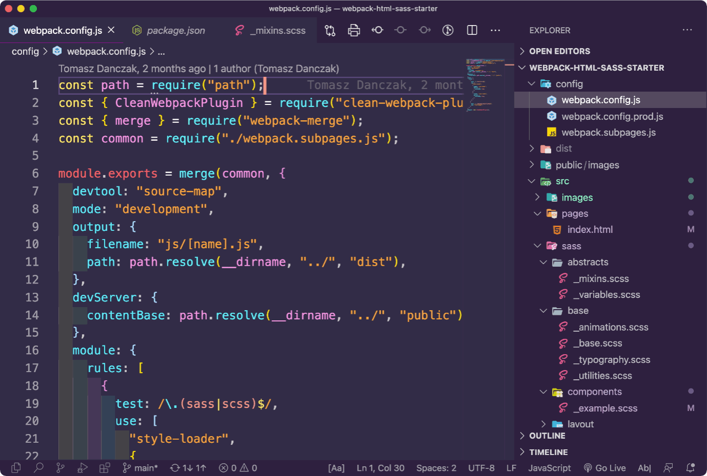
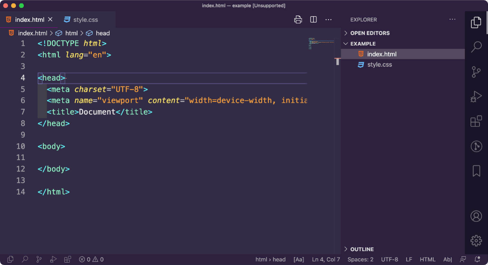

# Konfiguracja Visual Studio Code



Jest to konfiguracja przydatnych wtyczek i ustawień dzięki którym praca w [Visual Studio Code](https://code.visualstudio.com/) może stać się przyjemniejsza i bardziej efektywna.

Poniżej opisany został sposób doprowadzenia swojego edytora do stanu przedstawionego na powyższym gifie.

Umieszczony został także krótki opis użytych wtyczek oraz wpisów konfiguracyjnych.

## 1. Przeniesienie ustawień do swojego edytora

Aby doprowadzić swój Visual Studio Code do stanu przedstawionego w tej dokumentacji należy:

1. Zainstalować wszystkie wtyczki,
2. Skopiować ustawienia do pliku settings.json.

### 1.1 Instalacja wtyczek

W celu instalacji wszystkich wtyczek należy skopiować poniższy kod do terminala w Visual Studio Code (terminal uruchamia się za pomocą komendy `CTRL + &#96` lub `View → Terminal`).

> Po zainstalowaniu wszystkich wtyczek należy uruchomić ponownie Visual Studio Code

```json
code --install-extension alefragnani.Bookmarks
code --install-extension CoenraadS.bracket-pair-colorizer
code --install-extension eamodio.gitlens
code --install-extension esbenp.prettier-vscode
code --install-extension formulahendry.auto-rename-tag
code --install-extension Gruntfuggly.activitusbar
code --install-extension jeff-hykin.polacode-2019
code --install-extension oderwat.indent-rainbow
code --install-extension pdconsec.vscode-print
code --install-extension PKief.material-icon-theme
code --install-extension ritwickdey.LiveServer
code --install-extension RobbOwen.synthwave-vscode
code --install-extension ryu1kn.text-marker
code --install-extension shardulm94.trailing-spaces
code --install-extension spywhere.guides
code --install-extension vincaslt.highlight-matching-tag
```


### 1.2 Kopiowanie ustawień

Należy przekopiować całą poniższą konfiguracje, do pliku settings.json w swoim edytorze.

```json
{
  "window.zoomLevel": 1,
  "[javascript]": {
    "editor.defaultFormatter": "esbenp.prettier-vscode"
  },
  "[html]": {
    "editor.defaultFormatter": "vscode.html-language-features"
  },
  "[scss]": {
    "editor.defaultFormatter": "esbenp.prettier-vscode"
  },
  "workbench.colorTheme": "SynthWave '84",
  "workbench.sideBar.location": "right",
  "workbench.activityBar.visible": false,
  "editor.fontSize": 16,
  "editor.cursorBlinking": "expand",
  "editor.cursorWidth": 4,
  "editor.formatOnSave": true,
  "files.autoSave": "onFocusChange",
  "trailing-spaces.trimOnSave": true,
  "highlight-matching-tag.styles": {
    "opening": {
      "full": {
        "highlight": "rgba(20, 180, 80, 0.3)"
      }
    },
    "closing": {
      "full": {
        "highlight": "rgba(20, 180, 80, 0.3)"
      }
    }
  },
  "editor.tabSize": 2,
  "editor.detectIndentation": false,
  "workbench.iconTheme": "material-icon-theme",
  "editor.renderIndentGuides": false
}
```

Jedną z metod otworzenia pliku settings.json w swoim edytorze jest uruchomienie Command Pallete (`CMD + SHIFT + P` na Mac lub `CTRL + SHIFT + P` na Windows) a następnie wpisanie polecenia Open Settings (JSON).


## 2. Opis wtyczek i ich konfiguracji

### 2.1 polacode-2020

Wtyczka pozwala na robienie screena kodu zawierającego setki linii kodu albo tylko części w zależności od tego jaki fragment się zaznaczy.


### 2.2 indent rainbow

Prosta wtyczka zwiększająca czytelność wcięć.

To rozszerzenie koloruje wcięcia przed tekstem naprzemiennie czterema różnymi kolorami.


### 2.3 SynthWave '84

Ładny Theme.


Theme występuje w dwóch wersjach.
W celu wyłączenia Neon Dreams należy uruchomić Command Pallete i wpisać komendę: `Synthwave '84: Disable Neon Dreams` a następnie zrestartować edytor.


### 2.4 Prettier

Automatyczne formatowanie kodu.


Warto podpiąć automatyczne formatowanie przy każdym zapisie pliku poprzez dodanie poniższego wpisu do settigns.json.

```json
"editor.formatOnSave": true,
```

### 2.5 GitLens

Wtyczka przydatna do pracy z gitem w VSC.


### 2.6 Bookmarks

Pozwala na tworzenie zakładek w kodzie i przenoszenie się pomiędzy nimi.

- `Command + Option + J` - przenosi do poprzedniej zakładki
- `Command + Option + K` - tworzy/usuwa zakładkę
- `Command + Option + L` - przenosi do następnej zakładki


### 2.7 Bracket Pair Coloraiser

Dodaje kolorowanie nawiasów, dzięki czemu łatwiej odnaleźć się w zagnieżdżeniach.


### 2.8 Guides

Wtyczka dodaje belki sprawiające, że stopień zagnieżdżenia jest bardziej czytelny.


### 2.9 Activitus

Umieszcza ikony z Activity Bar w status bar.


### 2.10 Auto Rename Tag

Wtyczka zapewnia jednoczesną edycję tagu otwierającego i zamykającego.


### 2.11 Trailing Spaces

Wtyczka pokazuje niepotrzebne spacje w dokumencie.


Dzięki dodaniu poniższego wpisy do pliku settings.json zbędne spacje będą automatycznie usuwane przy zapisie pliku.

```json
"trailing-spaces.trimOnSave": true,
```

### 2.12 Highling Matching Tag

Dodaje podświetlenie do tagu otwierającego i zamykającego, dzięki czemu łatwiej można się odnależć w kodzie HTML.


Kolory podświetlenia można dostosować według własnego upodobania. Powyższą kolorystykę zapewnia dodanie poniższego wpisu do pliku settings.json

```json
"highlight-matching-tag.styles": {
    "opening": {
      "full": {
        "highlight": "rgba(20, 180, 80, 0.3)"
      }
    },
    "closing": {
      "full": {
        "highlight": "rgba(20, 180, 80, 0.3)"
      }
    }
  },
```

### 2.13 Print Code

Wtyczka pozwala na wydrukowanie kodu (wraz z kolorowaniem składni). W celu uruchomienia drukowania należy uruchomić **Command Pallet** i wpisać komendę: `Printing: Print`

> Jeżeli podczas drukowania będzie zaznaczony fragment kodu to tylko on zostanie wydrukowany.

> Jeżeli żaden fragment kodu nie zostanie zaznaczony to zostanie wydrukowany cały dokument.


#### Podgląd wydruku:


### 2.14 Material Icon Theme


### 2.15 Text Marker

Wtyczka pozwala podświetlić fragment tekstu.


# 3. Opis innych konfiguracji

#### 3.1 Animowany kursor


Kolor kursora jest brany z aktualnego Themu. Za efekt mrugającego kursora odpowiadają dwie poniższe linie dodane do settings.json.

```json
"editor.cursorBlinking": "expand",
"editor.cursorWidth": 4,
```

#### 3.2 Auto zapis pliku

Plik jest zapisywany automatycznie, gdy zmieniamy focus na inny plik. Przydaje się ponieważ nie trzeba pamiętać o zapisie.


```json
"files.autoSave": "onFocusChange",
```

#### 3.3 Przeniesienie sidebara na prawą stronę

Dzięki przeniesieniu sidebara na prawo eliminujemy irytujący problem przesuwania kodu po otwarciu i zamknięciu sidebara.


Żeby przenieść sidebar na prawo, można otworzyć Command Palette (`Shift + Command + P` na Mac) i wpisać `Toogle Sidebar Position`.


#### 3.4 Ukrycie Activity Bar

Dzięki ukryciu Activity Bar zyskujemy więcej miejsca w edytorze.
Dzięki zainstalowaniu wtyczki Activitius wszystkie ikony znajdują się na dolnej belce.

Żeby ukryć Activity Bar można otworzyć Command Palette (`Shift + Command + P na Mac`) i wpisać `Toogle Activity Bar Visibility`.



#### 3.5 Ustawienie tabulatora na 2 spacje

Zmniejszenie rozmiaru wcięć z domyślnych 4 na 2 w celu uzyskania bardziej zwięzłego kodu.

```json
"editor.tabSize": 2,
"editor.detectIndentation": false,
```

---

Copyright (c) 2021 Tomasz Dańczak
